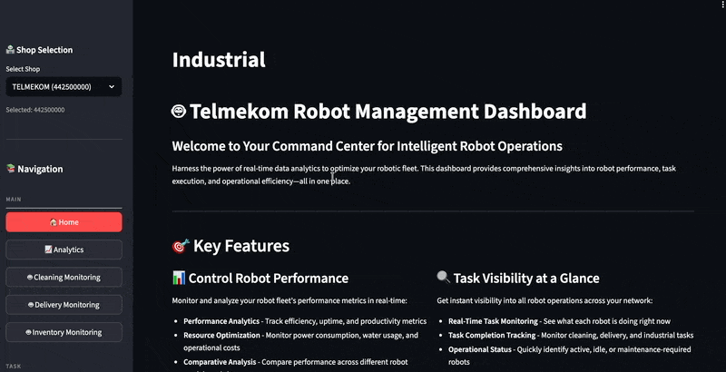
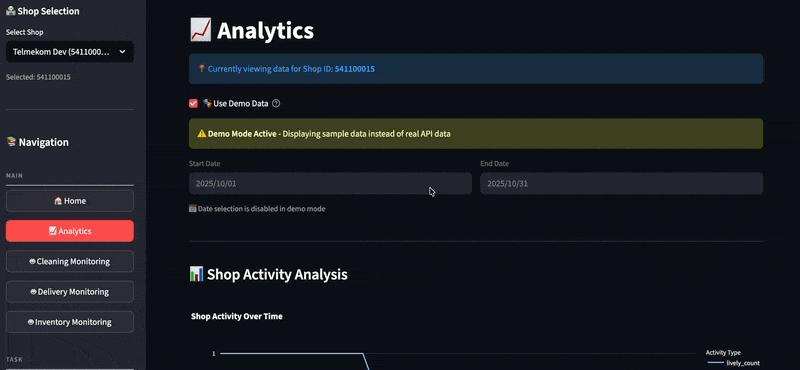
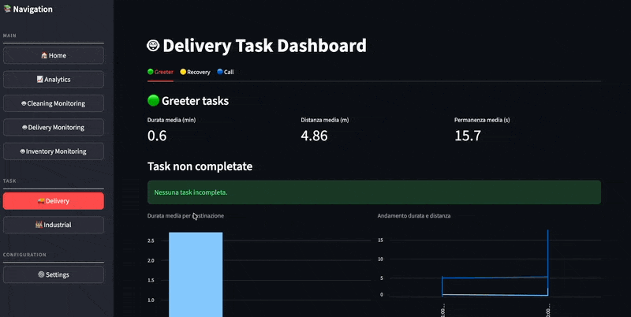
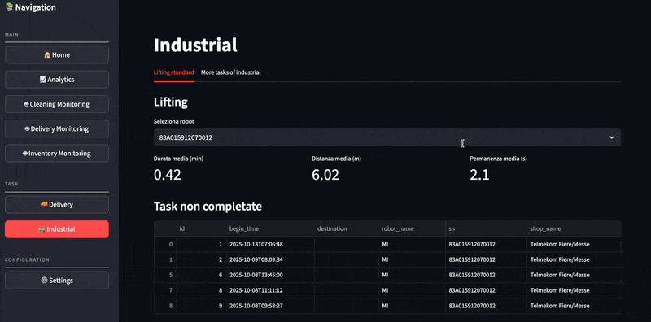

# 🤖 MechaLink - Intelligent Robot Management Platform

<div align="center">

**A comprehensive, real-time robot fleet monitoring and analytics dashboard**

[](https://www.python.org/downloads/)
[](https://streamlit.io/)
[](https://fastapi.tiangolo.com/)
[](https://www.postgresql.org/)

</div>

---

## 📋 Table of Contents

- [Overview](#-overview)
- [Key Features](#-key-features)
- [Architecture](#-architecture)
- [Getting Started](#-getting-started)
- [Dashboard Capabilities](#-dashboard-capabilities)
- [Customization](#-customization)
- [API Documentation](#-api-documentation)
- [Database Schema](#-database-schema)
- [Development](#-development)
- [License](#-license)

---

## 🌟 Overview

**MechaLink** is a state-of-the-art robot fleet management platform designed to provide comprehensive monitoring, analytics, and operational insights for diverse robotic systems. Built with modern technologies and a focus on scalability, MechaLink enables businesses to optimize their robotic operations across multiple locations.

### What Makes MechaLink Different?

- **🎨 Beautiful & Intuitive UI** - Modern Streamlit interface with custom styling and responsive design
- **📊 Real-Time Monitoring** - Live robot tracking with interactive visualizations
- **🏭 Multi-Robot Support** - Cleaning, delivery, and industrial robots in one platform
- **🔧 Highly Customizable** - Adapt dashboards to your specific business needs
- **🏪 Multi-Location Ready** - Manage robots across multiple shops/facilities
- **📈 Advanced Analytics** - Deep insights into performance, efficiency, and operations
- **🎭 Demo Mode** - Test features with sample data before going live

---

## ✨ Key Features

### 1. **Comprehensive Robot Monitoring**

#### 🧹 Cleaning Robot Monitoring

- **Interactive Floor Plans** - Real-time visualization of cleaning robots with realistic billiard room/gaming lounge layouts
- **Movement Tracking** - Trail visualization showing complete cleaning paths
- **Area Coverage Analysis** - Track cleaned areas, clean counts, and efficiency metrics
- **Status Indicators** - Battery level, cleaning mode, and operational status
- **Timeline Controls** - Replay robot movements and analyze patterns

#### 🚚 Delivery Robot Monitoring

- **Restaurant Layout Visualization** - Dynamic floor plans with tables, kitchen, bar, and service areas
- **Delivery Tracking** - Monitor food/item delivery from kitchen to tables
- **Route Optimization** - Analyze delivery paths and efficiency
- **Task Management** - Track greeter, recovery, and call tasks
- **Performance KPIs** - Duration, mileage, and stay duration metrics


#### 🏭 Industrial Robot Monitoring

- **Warehouse Layout** - Industrial facility visualization with racks, loading zones, and workstations
- **Lifting Operations** - Animated robotic arm with lifting phases (idle, lifting, moving, lowering)
- **Load Tracking** - Product identification and destination tracking
- **Safety Zones** - Visual safety area indicators
- **Operational Metrics** - Duration, mileage, and task completion tracking

### 2. **Advanced Analytics Dashboard**

#### 📊 Shop Activity Analysis

- Total tasks completed over time
- Robot activity patterns and trends
- Peak operation hours identification
- Multi-shop comparison capabilities

#### 🧹 Cleaning Performance

- Area coverage statistics
- Cleaning efficiency metrics
- Water and power consumption tracking
- Maintenance scheduling insights

#### 🤖 Robot Statistics

- Fleet-wide performance overview
- Individual robot performance
- Error rates and uptime analysis
- Resource utilization metrics

#### 📅 Time-Based Analysis

- Custom date range selection
- Historical trend analysis
- Seasonal pattern identification
- Predictive insights

### 3. **Task Management**

#### Delivery Tasks

- **Greeter Tasks** - Welcome and escort operations
- **Recovery Tasks** - Table cleanup and retrieval
- **Call Tasks** - On-demand service requests
- Task completion tracking
- Incomplete task alerts
- Average duration and distance metrics

#### Industrial Tasks

- **Lifting Operations** - Automated material handling
- **Destination Tracking** - Monitor item placement
- Robot-specific task filtering
- Performance metrics per robot
- Workload distribution analysis

### 4. **Multi-Shop Management**

- **Shop Selection** - Easy switching between locations
- **Shop-Specific Data** - Filtered views per location
- **Cross-Shop Analytics** - Compare performance across shops
- **Centralized Management** - Control all locations from one dashboard

### 5. **Real-Time Visualization**

- **Interactive Maps** - Plotly-powered dynamic floor plans
- **Live Position Updates** - Real-time robot location tracking
- **Direction Indicators** - Visual arrows showing robot heading
- **Trail Visualization** - Historical movement paths
- **Status Badges** - Clear operational status indicators
- **Hover Details** - Comprehensive information on hover

### 6. **Settings & Configuration**

- **Robot Parameters** - Customize robot settings
- **Task Configuration** - Define task parameters
- **Alert Thresholds** - Set performance alerts
- **Map Customization** - Adjust floor plan layouts
- **User Preferences** - Personalize dashboard views

---

## 🏗️ Architecture

MechaLink follows a modern, microservices-inspired architecture:

```
┌─────────────────────────────────────────────────────────────┐
│                     Frontend Layer                          │
│                  (Streamlit Dashboard)                      │
│  • Analytics • Robot Monitoring • Task Management           │
│  • Settings • Multi-Shop Support • Visualizations           │
└──────────────────────┬──────────────────────────────────────┘
                       │ HTTP/REST
                       ▼
┌─────────────────────────────────────────────────────────────┐
│                   Serving Layer (API)                       │
│                     (FastAPI)                               │
│  • REST Endpoints • Data Aggregation • Business Logic       │
└──────────────────────┬──────────────────────────────────────┘
                       │
                       ▼
┌─────────────────────────────────────────────────────────────┐
│                    Database Layer                           │
│                   (PostgreSQL 16)                           │
│  • Robot Data • Task Logs • Analytics • Time-Series         │
└──────────────────────┬──────────────────────────────────────┘
                       │
                       ▼
┌─────────────────────────────────────────────────────────────┐
│                  Ingestion Layer                            │
│               (Python Data Pipelines)                       │
│  • API Integration • Data Transformation • ETL              │
└─────────────────────────────────────────────────────────────┘
```

### Technology Stack

**Frontend:**

- Streamlit 1.51.0+ - Interactive web dashboard
- Plotly Express - Advanced visualizations
- Custom CSS/JavaScript - Enhanced UX

**Backend:**

- FastAPI 0.121.0+ - High-performance API
- Python 3.12+ - Core business logic
- Psycopg 3.2.12+ - Database connectivity

**Database:**

- PostgreSQL 16 - Primary data store
- Time-series optimization
- JSONB for flexible data structures

**Infrastructure:**

- Docker & Docker Compose - Containerization
- Multi-container orchestration
- Environment-based configuration

---

## 🚀 Getting Started

### Prerequisites

- Python 3.12 or higher
- Docker & Docker Compose
- Git
- 4GB+ RAM recommended
- 2GB+ free disk space

### Quick Start

1. **Clone the Repository**

   ```bash
   git clone https://repos.hackathon.bz.it/2025-sfscon/team-11.git
   cd team-11
   ```

2. **Build and Start Services**

   ```bash
   make build-app
   ```

   This command will:

   - Start PostgreSQL container
   - Create database tables
   - Ingest master and fact data
   - Build and start all services

3. **Access the Dashboard**

   Open your browser (Chrome is the recommended browser) and navigate to:

   ```
   http://localhost:8501
   ```

4. **Access the API Documentation**
   ```
   http://localhost:8000/docs
   ```

### Alternative Commands

**Run existing build:**

```bash
make run-app
```

**Manual setup (without Docker):**

```bash
# Install dependencies
uv pip install -e .

# Start PostgreSQL (if running locally)
# Update connection strings in environment

# Create tables
uv run ./src/ingestion/create_table.py

# Load data
uv run ./src/ingestion/master_data.py
uv run ./src/ingestion/fact_data.py

# Start services manually
cd src/serving_layer && uvicorn serving_layer:app --reload
cd streamlit_app && streamlit run app.py
```

---

## 📊 Dashboard Capabilities

### 🏠 Home Dashboard

Your command center for intelligent robot operations:

- **Welcome Overview** - Quick introduction and navigation
- **Key Metrics at a Glance** - High-level operational summary
- **Quick Actions** - Fast access to common tasks
- **Recent Activity** - Latest robot operations
- **System Status** - Overall health indicators

### 📈 Analytics Page

Comprehensive performance insights:

#### Shop Activity Analysis

- **Task Volume Trends** - Visualize task completion over time
- **Activity Heatmaps** - Identify peak operation hours
- **Robot Utilization** - Track fleet usage patterns
- **Efficiency Metrics** - Measure operational efficiency

#### Cleaning Performance

- **Coverage Maps** - Area-by-area cleaning visualization
- **Efficiency Scoring** - Performance benchmarking
- **Resource Usage** - Water, power, and consumables tracking
- **Maintenance Alerts** - Predictive maintenance indicators

#### Robot Statistics

- **Fleet Overview** - All robots at a glance
- **Individual Performance** - Deep-dive per robot
- **Error Analysis** - Identify and resolve issues
- **Uptime Tracking** - Reliability metrics

#### Customizable Date Ranges

- Pre-set periods (Today, Week, Month, Custom)
- Historical data analysis
- Trend comparison
- Seasonal insights

### 🤖 Robot Monitoring Pages

#### Cleaning Robot Monitoring

**Features:**

- Real-time position tracking on floor plan
- Movement trail visualization
- Area coverage percentage
- Cleaning mode indicators (vacuum, mop, sweep)
- Battery status monitoring
- Speed and direction display
- Timeline scrubber for playback
- Point-of-interest markers

**Use Cases:**

- Monitor cleaning progress in real-time
- Verify complete area coverage
- Identify missed spots
- Optimize cleaning routes
- Schedule maintenance based on usage

#### Delivery Robot Monitoring

**Features:**

- Restaurant floor plan with tables and kitchen
- Delivery route tracking
- Table assignment monitoring
- Order completion status
- Wait time tracking
- Traffic flow analysis
- Collision avoidance visualization
- Service quality metrics

**Use Cases:**

- Optimize delivery routes
- Reduce customer wait times
- Balance workload across robots
- Identify bottlenecks
- Improve service efficiency

#### Industrial Robot Monitoring

**Features:**

- Warehouse layout visualization
- Robotic arm animation
- Lifting phase tracking (idle → lifting → moving → lowering)
- Load identification
- Destination tracking
- Safety zone indicators
- Rack location mapping
- Performance metrics per operation

**Use Cases:**

- Monitor material handling operations
- Track inventory movements
- Ensure safety compliance
- Optimize warehouse layout
- Measure productivity

### 🚚 Delivery Task Management

**Three Task Types:**

1. **Greeter Tasks**

   - Customer welcoming operations
   - Escort to tables
   - Menu delivery
   - Average duration tracking
   - Incomplete task alerts

2. **Recovery Tasks**

   - Table cleanup operations
   - Dish collection
   - Tray retrieval
   - Distance traveled metrics
   - Multi-shop comparison

3. **Call Tasks**
   - On-demand service requests
   - Emergency calls
   - Special requests
   - Response time tracking
   - Stay duration analysis

**Analytics:**

- KPI cards (duration, mileage, stay time)
- Incomplete task monitoring
- Performance charts by destination
- Temporal trend analysis
- Raw data tables for deep dives

### 🏭 Industrial Task Management

**Lifting Operations:**

- Robot selection dropdown
- Task filtering by robot
- Duration and mileage metrics
- Stay time analysis
- Incomplete task tracking
- Destination-based performance charts
- Temporal trends
- Robot identification details (SN, MAC, Model)

### ⚙️ Settings Page

**Customization Options:**

- Robot configuration parameters
- Task type definitions
- Alert threshold settings
- Map layout customization
- Display preferences
- Data refresh intervals
- Export settings
- User permissions (future)

---

## 🔧 Customization

MechaLink is designed to be **highly customizable** to accommodate diverse customer needs:

### 1. **Dashboard Customization**

#### Custom Branding

```python
# streamlit_app/app.py
st.set_page_config(
    page_title="Your Company Name",
    page_icon="🤖",  # Custom icon
    layout="wide",
)
```

#### Custom Color Schemes

Modify CSS in `streamlit_app/app.py` to match your brand:

```python
st.markdown("""
<style>
    .area-header {
        background: linear-gradient(135deg, #YOUR_COLOR_1, #YOUR_COLOR_2);
    }
</style>
""", unsafe_allow_html=True)
```

### 2. **Floor Plan Customization**

#### Add Custom Locations

Edit the layout generation functions in monitoring pages:

```python
# Example: Add a new room type
def generate_custom_room_layout(area_size, width_px=800, height_px=600):
    # Define your room layout
    # Add furniture, equipment, zones
    # Return plotly figure
    pass
```

#### Adjust Map Coordinates

Modify `MAP_CONFIG` in monitoring pages:

```python
MAP_CONFIG = {
    "YourMapName": {
        "image_width": 1200,
        "image_height": 800,
        "x_min": 0,
        "x_max": 50,  # Adjust to your space
        "y_min": 0,
        "y_max": 30,
    }
}
```

### 3. **Robot Type Customization**

#### Add New Robot Types

1. Create a new monitoring page in `streamlit_app/pages/`
2. Define robot-specific visualization
3. Add database table for robot data
4. Register page in `app.py`

Example structure:

```python
# streamlit_app/pages/robot_security_monitoring.py
def render():
    st.title("🔒 Security Robot Monitoring")
    # Your custom monitoring logic
```

### 4. **Metric Customization**

#### Add Custom KPIs

```python
# In any analytics page
col1, col2, col3, col4 = st.columns(4)
col1.metric("Your Custom Metric", your_value)
col2.metric("Another Metric", another_value)
# Add as many as needed
```

#### Custom Charts

```python
# Use any chart type
st.bar_chart(your_data)
st.line_chart(your_data)
st.area_chart(your_data)

# Or use Plotly for advanced customization
import plotly.express as px
fig = px.scatter(df, x="x", y="y", size="size", color="category")
st.plotly_chart(fig)
```

### 5. **Task Type Customization**

#### Define New Task Categories

1. Add table to database schema (`src/ingestion/create_table.py`)
2. Create ingestion logic for task data
3. Add API endpoint in serving layer
4. Create UI page in streamlit_app

### 6. **Multi-Tenant Customization**

#### Add Company/Client Branding

```python
# Load client-specific configuration
if st.session_state.client_id == "CLIENT_A":
    logo = "logo_client_a.png"
    color_scheme = CLIENT_A_COLORS
else:
    logo = "logo_client_b.png"
    color_scheme = CLIENT_B_COLORS
```

### 7. **Data Source Customization**

#### Add External APIs

```python
# src/ingestion/robot_api/your_api.py
def fetch_from_custom_api():
    response = requests.get("https://your-api.com/data")
    return response.json()
```

#### Custom Data Transformations

```python
# src/computation_layer/computation_layer.py
def transform_custom_data(raw_data):
    # Your transformation logic
    return transformed_data
```

### 8. **Alert Customization**

#### Define Custom Alerts

```python
# Check custom conditions
if robot_battery < threshold:
    st.warning(f"⚠️ Low battery alert for {robot_name}")

if task_duration > max_duration:
    st.error(f"🚨 Task exceeding time limit: {task_id}")
```

### 9. **Export Customization**

#### Custom Report Formats

```python
# Add export buttons
if st.button("Export to PDF"):
    generate_pdf_report(data)

if st.button("Export to Excel"):
    df.to_excel("report.xlsx")

if st.button("Send Email Report"):
    send_email_report(recipient, data)
```

---

### Base URL

```
http://localhost:8000
```

### Key Endpoints

#### Delivery Tasks

```
GET /delivery/greeter?shop_id={shop_id}&limit={limit}
GET /delivery/recovery?shop_id={shop_id}&limit={limit}
GET /delivery/call?shop_id={shop_id}&limit={limit}
```

#### Industrial Tasks

```
GET /lifting?shop_id={shop_id}&limit={limit}
```

#### Analytics

```
GET /analytics/shop/{shop_id}?start_date={date}&end_date={date}
GET /analytics/robots?shop_id={shop_id}
GET /analytics/cleaning?shop_id={shop_id}
```

#### Shops

```
GET /shops
GET /shops/{shop_id}
```

### Example Request

```bash
curl -X GET "http://localhost:8000/delivery/greeter?shop_id=520400008&limit=50" \
     -H "accept: application/json"
```

### Example Response

```json
{
  "greeter_tasks": [
    {
      "id": 1,
      "arrival_time": "2025-11-08T10:30:00",
      "begin_time": "2025-11-08T10:25:00",
      "cur_duration": 5.5,
      "cur_mileage": 12.3,
      "destination": "Table_5",
      "robot_name": "Greeter_01",
      "sn": "SN123456",
      "shop_id": 520400008,
      "shop_name": "Main Restaurant"
    }
  ]
}
```

---

## 🗄️ Database Schema

### Core Tables

#### Master Data

- **company** - Company information
- **shop** - Shop/location details
- **robots** - Robot inventory and specifications
- **task** - Task definitions

#### Robot Logs

- **robot_status_log** - Robot health and status
- **robot_error_log** - Error tracking
- **robot_charge_log** - Battery and charging data

#### Cleaning Operations

- **cleaning_task** - Cleaning job definitions
- **cleaning_area** - Areas to clean
- **task_config** - Task parameters
- **station** - Charging/service stations
- **back_point** - Return points
- **map** - Floor plan data

#### Delivery Operations

- **robot_delivery_greeter_task** - Greeter operations
- **robot_delivery_recovery_task** - Recovery operations
- **robot_delivery_call_task** - Call operations

#### Industrial Operations

- **robot_industrial_lifting_task** - Lifting operations

#### Movement Tracking

- **robot_movement** - Position history

### Schema Diagram

```
company (1) ──┬── (N) shop
              │
              └── (N) robots ──┬── (N) task
                               │
                               ├── (N) robot_status_log
                               ├── (N) robot_error_log
                               ├── (N) robot_charge_log
                               ├── (N) cleaning_task
                               ├── (N) robot_delivery_*_task
                               ├── (N) robot_industrial_*_task
                               └── (N) robot_movement
```

---

## 💻 Development

### Project Structure

```
mechalink/
├── src/
│   ├── computation_layer/      # Data processing and analytics
│   │   ├── computation_layer.py
│   │   └── Dockerfile
│   ├── ingestion/              # Data ingestion pipelines
│   │   ├── create_table.py
│   │   ├── master_data.py
│   │   ├── fact_data.py
│   │   └── robot_api/          # External API integrations
│   │       ├── robots.py
│   │       ├── shops.py
│   │       ├── maps.py
│   │       └── analysis.py
│   ├── serving_layer/          # FastAPI backend
│   │   ├── serving_layer.py
│   │   └── Dockerfile
│   └── utils/                  # Shared utilities
├── streamlit_app/              # Frontend dashboard
│   ├── app.py                  # Main application
│   ├── pages/                  # Dashboard pages
│   │   ├── analytics.py
│   │   ├── robotCleaningMonitoring.py
│   │   ├── robotDeliveringMonitoring.py
│   │   ├── robotLiftingMonitoring.py
│   │   ├── delivery.py
│   │   ├── industrial.py
│   │   └── settings.py
│   ├── utils/                  # Frontend utilities
│   │   └── helpers.py
│   ├── Dockerfile
│   └── requirements.txt
├── data/                       # PostgreSQL data directory
├── query/                      # SQL queries
├── docker-compose.yml          # Container orchestration
├── Makefile                    # Build commands
├── pyproject.toml             # Python dependencies
├── uv.lock                    # Lock file
└── README.md                  # This file
```

### Development Workflow

1. **Make Changes**

   ```bash
   # Edit files in src/ or streamlit_app/
   ```

2. **Test Locally**

   ```bash
   # Rebuild containers
   make build-app
   ```

3. **Database Migrations**

   ```bash
   # Update schema
   uv run ./src/ingestion/create_table.py
   ```

4. **Add New Features**
   - Create new pages in `streamlit_app/pages/`
   - Add API endpoints in `src/serving_layer/`
   - Update database schema if needed
   - Add tests

### Code Style

- Python: Follow PEP 8
- SQL: Use uppercase keywords
- Comments: Clear and concise
- Functions: Single responsibility principle

---

## 📄 License

## This project is licensed under the GNU AFFERO GENERAL PUBLIC LICENSE - see the [LICENSE](LICENSE) file for details.

## 🙏 Acknowledgments

- Built with ❤️ by Team 11 (DragAndDrop)

  - [Anthony Tricarico](https://github.com/anthony-tricarico)
  - [Matteo Massari](https://github.com/matteo-massari)
  - [Ettore Miglioranza](https://github.com/ettoremiglioranza1012)

- Powered by amazing open-source projects:
  - [Streamlit](https://streamlit.io/)
  - [FastAPI](https://fastapi.tiangolo.com/)
  - [PostgreSQL](https://www.postgresql.org/)
  - [Plotly](https://plotly.com/)
  - [Docker](https://www.docker.com/)

---

## 📚 Additional Resources

### Demo GIFs

We put up a collection of GIFs to understand the basic functionality of our solution.

#### Home



#### Analytics



#### Cleaning Task


#### Delivery Task




#### Lifting Task


#### Industrial Analysis



---

<div align="center">

⭐ Star us on GitHub if you find MechaLink helpful!

</div>
